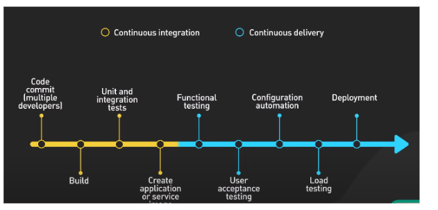

###  DEVOPS WORKFLOW : 
  
    

### tools
   **code**
> * git  
> * gitlab
 
  **Build tools**

*  maven    
* msbuild
* jenkins
* gradle
 
**configuration managment tools**
   * Ansible
   * chef
   * puppet

  **Infrastructure as a service**    
 > * terraform.
 > * aws cloud farmation.
 
  **Containerization tools**
 > * docker
 > * containerd
 > * Rancher
###  **orchestarization tools**
  * docker swarm
  * kubernates  

### 1. Activity: 
>Some activity to understand build code.
1. manual 
2. Jenkinsfile
3. Dockerfile    
### 2. Activity:
### Understanding of ansible.
 * install apache server on five machine or create five file and delete.
 ~~~
                    Thank you
~~~
   

 