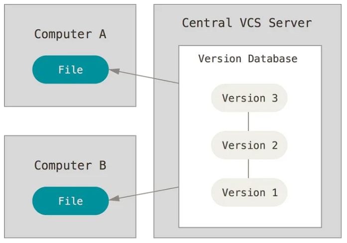
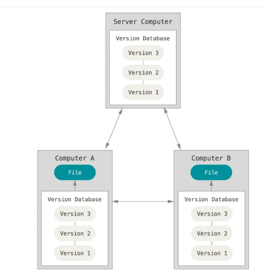
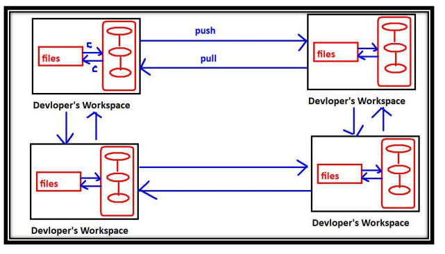
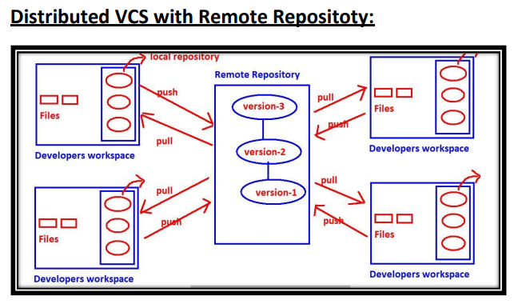

### **Introduction to version control system**
>  Version Control System is also known as Software Configuration Management (SCM) OR 
Source Code Management (SCM) System.

* **Need of Version Control System?**
---
> * Being a developer we have to write several files which contains source code.
> * Developer Write  >>>>> Code  >>>>>  Files
 * to store this file we need one version control system.
#### **Version control system are two types** 
  1. centralized version control system.
  2. distributed version control system.
  ### centralized version control system
  ---

  --- 
This type of VCS is very easy to setup and use.
Eg: CVS, SVN, Perforce, TFS, Clearcase etc
---
**Problems with Centralized VCSs:**
1) Central Repository is the only place where everything is stored, which causes single 
point of failure. If something goes wrong to the central repository then recovery is 
very difficult.
2) All commit and checkout operations should be performed by connecting to the central 
repositoty via network. If network outage, then no version control to the developer. 
i.e in this type, developer work space and remote repository server should be 
connected always.
3) All commit and checkout operations should be performed by connecting to the central 
repositoty via network and hence these operations will become slow, which causes 
performance issues. No local operations and every version control operation should be 
remote operation.
4) Oranization of central repository is very complex if number of developers and files 
increases.
etc.
### **Distributed Version Control Systems:**
* The name itself indicates the respository is distributed and every developers workspace 
contains a local copy of the repository. There is no question of central repository.
.
---
If 4 developers are there then 4 repositories will be there.
1) The checkout and commit operations will be performed locally. Hence performance is 
more.
2) To perform checkout and commit operations network is not required. Hence if there is 
any network outage, still version control is applicable.
3) If something goes wrong to any repository there is a chance to recover. There is no 
question of single point of failure.
4) To perform push and pull operations network must be required, but these operations 
are not most common operations and we are performing very rarely.

Note:
1) commit and checkout operations will be performed between workspace and 
repository.
* work space – commit --->Repository
* Repository – checkout--->workspace
2) push and pull operations will be performed between repositories.
* one repository ---push ---> other repository.

* one repository<--- pull----other repository.
### **Distributed VCS with Remote Repositoty**
Remote Repository is not Central Repository:
1) Every developer has his own local copy of repository. It is not centralized and it is 
distributed only.
2) commit and checkout operations won't be performed on remote repository and these 
will be performed on local repository only.
The main job of remote repository is just to share our work to peer developers.
High availability, Speed and there is no single point of failure are main reasons for 
popularity of this model.
Eg: Git, Mercurial, Fossil.
.

