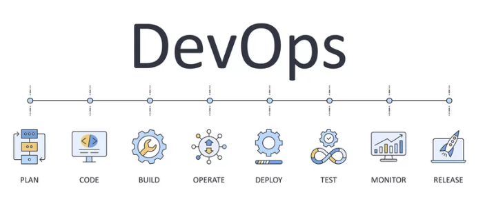
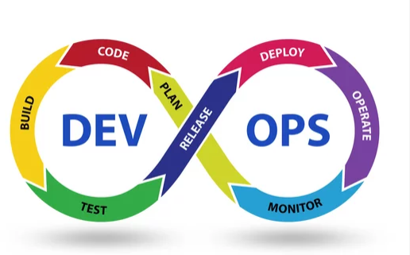
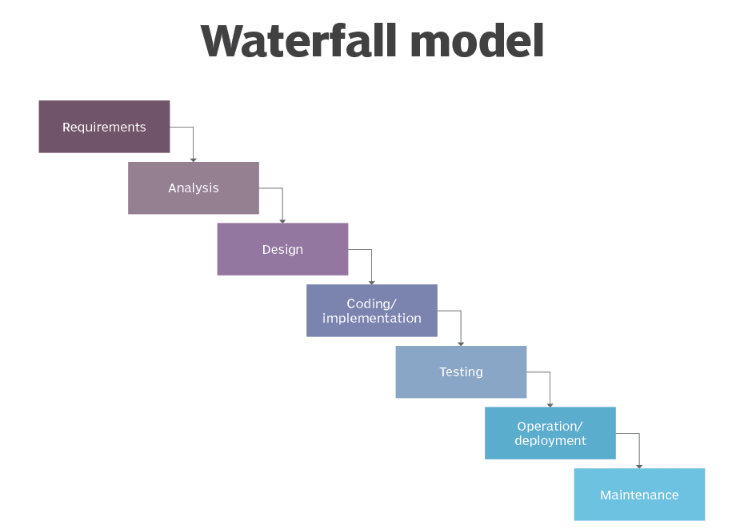
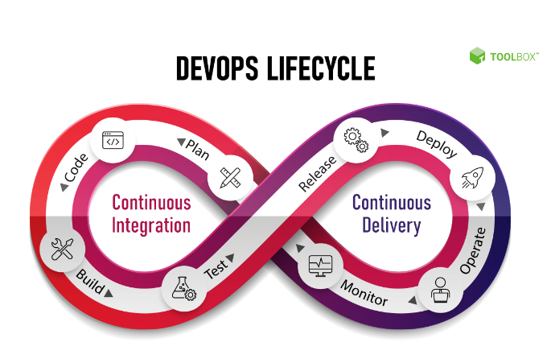
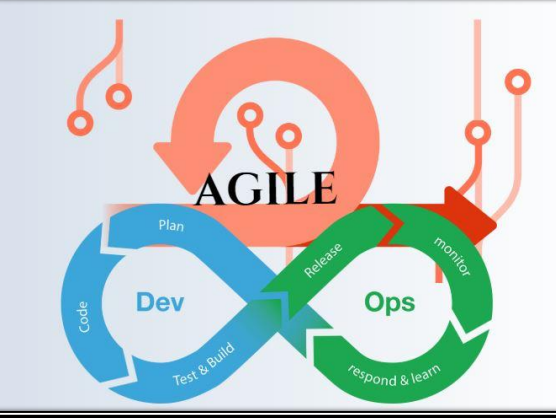

### What is DevOps ?
 * Devops is not a new tool/Technology in the market.

 * It is a new culture or process to develop,release and maintain software 
products/projects/applications with high quality in very faster way.
 * We can achieve this in devops by using several automation tools.
 * For any software development,release and maintenance, there are two groups of 
engineers will work in the company.
 * 1. Development Group
 * 2. Non-Development Group or Operations Group or Administrators Group.
 ### Development Group :
   * 1. planning
   * 2. coding
   * 3. building
   * 4. Testing
   ```
   example:
         Business Analyst(BA)
         System Analyst(SA)
         Design Architech(DA)
         Developers/coders
         Build Engineer
         Test Engineers/QA
   ```
###  Non-Development Group or Operational group
   * 1. Release   
   * 2. Deploy
   * 3. Operate
   * 4. Monitor
   ~~~
   example: 
           Release Engineers.
           Configuration Engineer.
           System Admin.
           Database Admin.
           Network Admin.
           etc.
   ~~~
### WHAT IS DEVOPS ?
 ~~~
 Devops is combination of development and operations. 
The main objective of devops is to implement collaboration between development and 
operations teams.
 ~~~
 
 ### DevOps logo
 

> **To understand this new Devops culture, we have to aware already existing SDLC Models.**
>> **SDLC : Software Development Life Cycle**
```
1) Waterfall Model
2) Prototype Model
3) Incremental/Iterative Model
4) Spiral Model
5) RAD Model
6) Big-Bang Model
7) Fish Model
8) V Model
9) Agile Model
10) Devops Culture
```

> **Waterfall Model :**
   
### let's assume this senario based on waterfall model: 
* 
 * in waterfall model one task completed then second task is started.
 ~~~
 1.build this Apartment.(5 year).
 2.piping department(1 year).
 3.ectrician department(1 year).
 4.painting (1 year).
 ~~~
 * After 8 years one room is ready for residential.
 * same story in application devlopment.
 ~~~
 client says i want to devlop one application and this this type of feature.
  1.company says ok it takes 1 year to devlop this application.
  2.After that in company project started and first devloper complete the code then build the code after that qa check the quality and uat finaly application deploy in production environment.
 ~~~

**Advantages:**
1) It is very simple and easy to implement.
2) Phases won't be overlapped and hence there is no ambiguity.
3) All phases will be executed one by one which gives high visibility to the project 
managers and clients about the progress of the project.
4) Best suitable if the requirements are fixed.
5) Best suitable for small projects.

**Disadvantages:**
1) It is very rigid model b'z it won't accept requirement changes in the middle.
2) Client satisfaction is very low because most of the times client will add new 
requirements in the middle,which won't be supported.
3) Total project development time is more because testing should be done after 
complementing development only.
4) The cost of bug fixing is very high because we cannot identify bugs in the early stages 
of life cycle.
5) Not suitable if the requirements keep on changing.
6) Not suitable for large projects.


### **AGILE MODEL **
 * This is the most frequently used and hot cake model for software development.
 * Agile Model is divided into several sub models
    1) Rational Unify Process (RUP)
    2) Adaptive Software Development (ASD)
    3) Feature Driven Development (FDD)
    4) Crystal Clear
    5) Dynamic Software Development Method (DSDM)
    6) Extream Programming (XP)
    7) Scrum

        etc.
 * Among all these models Scrum model is the most popular and frequently used model.
* Scrum is derived from Rugby Game.
.
* It is light weight process. 
* It is an iterative /incremental model and it accepts changes very easily.
* It is people based model but not plan based model.
* Team Collaboration and Continuous feedback are strengths of this model.
###  Water fall vs Scrum
  1) In water fall model ,before starting next phase,the previous phase should be 
completed. It is very rigid model and won't accept requirement changes in the middle.
2) But scurm model is not linear sequential model. It is iterative model. Total software 
will be developed increment by increment and each increment is called a sprint. 
Sprint is a deliverable/shippable product in scrum model.
* **Points to Remember:**
1) Scrum is an agile model that allows us focus on delivering highest quality software in 
shortest time.
2) In this model software developement follows increment by increment
3) Each increment will take 1 to 3 weeks duration.
4) 7 to 9 members are responsible in every sprint.
* The art of doing the twice work in half time is nothing but scrum model                           **(Juff sutherland)**
### **Advantages of Scrum Model:**
1) There is maximum chance for quality
2) It ensures effective use of time and money
3) Requirement changes will be accepted so that maximum chance for client satisfaction
4) There is a possibility for the client involvment in every stage.
5) Project status Tracking is very easy
6) Team gets complete visibility through scrum meetings.
* **Limitations:**
1) The chances of project failure is very high if individuals are not committed or 
cooperative
2) Adapting scrum model for large teams is very big challenge
3) Must required experienced and efficient team members
4) If any team member leaves in the middle of project,it can have a huge negative impact 
on the project.
### **Devops vs Agile Models:**
 Devops and Agile, both are not same.
* **Similarities:**
1) Both are software development methodologies. Agile is there in the market for the 
last 20 years, but devops is recent methodology.
2) Both models concentrating on rapid development of software project.
* **Differences:**
1) The differences between these models will starts after development of the project.
Agile methodology always talks about software development,testing and deployment.
Once deployment completed agile methodology has no role.
But Devops model will continue after deployment also and it is also responsible for 
operations and monitoring.
2) In Agile Model, separate people are responsible for developing, testing, and deploying 
the software. But, in DevOps, the DevOps engineer is responsible for everything; 
development to operations, and operations to development.
3) Agile model won't force us to use automation tools.
But devops model is completely based on automation.
4) Agile model always giving highest priority for speed, where as Devops giving proirity 
for both speed and automation.
5) In Agile, client is responsible to give the feedback for the sprint. But in Devops, 
immediate feedback is available from the monitoring tools.

.
.

### **What is Devops?**
~~~ 
1. Devops is not a new Tool/Technology in the market.

2. It is a new culture or process to develop,release and maintain software.

3. products/projects/applications with high quality in very faster way with automation tools.
4. Devops is combination of development and operations. 
5. The main objective of devops is to implement collaboration between development and 
operations teams.
6. It is the process of continuous development, continuous build, continuous test, 
7. continuous release of the software with high quality in very faster way with automation 
tools.
~~~
                        **THANK YOU**


