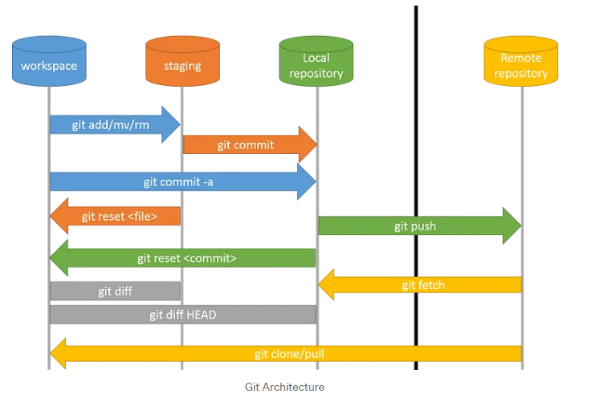
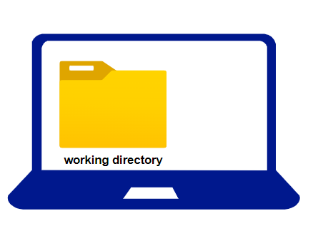
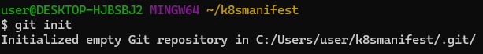

### What is GIT?
✽ Git is Distributed Version Control System Tool.

✽ Git is not acronym and hence no expansion.But most of the people abbreviated as

✽ "Global Information Tracker".

✽ GIT is developed by Linus Torvalds(Finnish software engineer), who also developed 
Linux Kenel.

✽ Most of the companies like Microsoft,Facebook,Yahoo,LinkedIn,Intel using Git as 
Version Control System Tool.
*  Features of GIT:
 Git is very popular because of the following features:
 
 **1) Distributed**
 ---
Git is developed based on Distributed Version Control System Architecture.
Because of Distributed Architecture it has several advantages:
* A) Every Developer has his own local repository. All the operations can be performed 
locally.Hence local repo and remote repo need not be connected always.
* B) All operations will be performed locally, and hence peformance is high when compared 
with other VCSs. i.e it is very speed
* C) Most of operations are local. Hence we can work offline most of the times.
* D) There is no single point failure as Every Developer has his own local repository.
* E) It enables parellel development & automatic-backups.

**2) Staging Area**:
---
It is also known as index area.
There is logical layer/virtual layer in git between working directory and local repository.
Working Directory -->> Staging Area -->> Local Repository
We cannot commit the files of working directory directly. First we have to add to the 
staging area and then we have to commit.
This staging area is helpful to double check/cross-check our changes before commit.
This type of layer is not available in other Version Control Systsem Tools like CVS, SVN etc
Git stores files in repository in some hash form, which saves space.
GIT will uses internally snapshot mechanism for this. All these conversions and taking 
snapshots of our data will be happened in staging area before commit.
Eg: If a sample repository takes around 12 GB space in SVN where as in GIT it takes hardly 
420 MB.
Hence Staging Area is the most important Strength of GIT.

**3) Branching and Merging:**
---
We can create and work on multiple branches simultaneously and all these are branches 
are isolated from each other. It enables multiple work flows.
We can merge multiple braches into a single brach. We can commit branch wise also.

4. Moving files in GIT is very easy as GIT automatically tracks the moves. Whereas in other 
VCS we need to create a new file & then delete the old one.
5. Freeware and Open Source
6. It provides support for multiple platforms.
### **git architecture**
---

### **working steps in git**
---
* step 1. Downlod git 
[ref.here](https://git-scm.com/download/win). 
* step2. create one account on github.
* step 3. configure user name and email.
### To check previous user information
---
~~~
git config --global --list
~~~  
### configure new user
---
~~~
git config --global user.name "shaif ali khan"
~~~
### configure email.
---
~~~
git config --global user.email "shaifalikhan5@gmail.com"
~~~

 ###  **Working With working directory**
 ---
 
 ### **steps**
 * 1. make working directory to repository.
 ~~~
 git init
 ~~~  
### output

* Now our working directory changed into git repository. if you visualised then it looks like.
 .

* when we type git init one .git folder got created
inside .git all activity will record.

---
* git add -->> To add files from working directory to staging area.
* git commit -->> To commit changes from staging area to local repository.
* git push -->> To move files from local repository to remote repository.
* git clone -->> To create a new local repository from the remote repository.
* git pull -->>To get updated files from remote repository to local repository.

---

