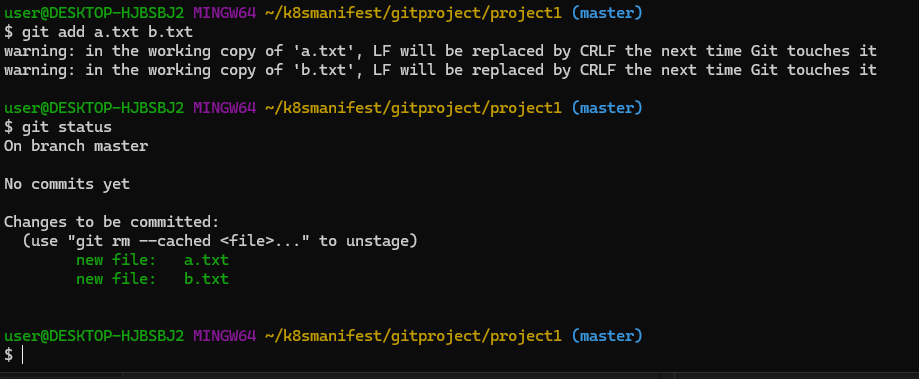
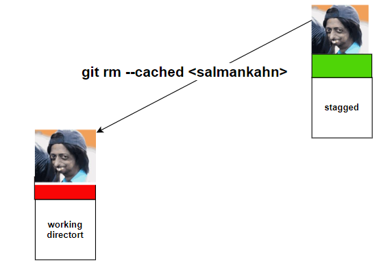

### **Life Cycle of File in GIT**
Every file in GIT is in one of the following states:

 **1)Untracked:**
---
✽ The files which are newly created in working directory and git does not aware of these 
files are said to be in untracked state.

 **2)Staged:**
---
✽ The files which are added to staging area are said to be in staged state.

✽ These files are ready for commit.

 **3)In Repository/ Committed:**
---
 ✽ Any file which is committed is said to be In Repository/Committed State.

**4)Modified:**

✽ Any file which is already tracked by git, but it is modified in working directory is said to 
be in Modified State.

 ### **To Understand Working Directory,Staging Area and local Repository**
 ---
 1) Creating workspace
2) git initialization
3) Creating files with some content in the working directory
4) Adding these files to staging area
5) Git Configurations before first commit
6) Commit those changes to local repository.
###  **From working directory to   staging area**
* Now project1 acts as working directory. We have to request git, to provide version control 
for this directory. For this we have to use git init command.

* git init -->> This command will provide empty repository for our working directory, so that 
version control is applicable for our workspace.
The name of the empty directory is .git, which is hidden directory.

Note: 
1) If our working directory contains any files, then these files won't be added to the local 
repository bydefault, we have to add explicitly.
2) If our working directory already contains local repository(.git), still if we call git init 
command, then there is no impact.
### **Creating Files with some Content and adding to staging Area and then commit:**
---

* 

###
~~~
git add a.txt b.txt
~~~

this means our file a.txt b.txt is added from working directory to staging area. color green.
.
### bring back from staging area to working directory

~~~
git restore --staged a.txt b.txt
~~~
.

---
###  **From staging area to local repository**
~~~
git commit -m "massages"
~~~

* after commit

--------------

### **Git reset Command**
--------------------
* git reset command is just like reset settings in our mobile.
* There are 2 utilities of git reset command.
> * Utility-1: To remove changes from staging area.
> * Utility-2: To undo commits at repository level.
### **Utility-1: To Remove Changes from staging Area:**
----------------------
* We can use git reset to remove changes from staging area.
* Changes already added to staging area, but if we don't want to commit, then to remove 
such type of changes from staging area, then we should go for git reset.
It will bring the changes from staging area back to working directory.
* It is opposite to git add command.
  * example:
.
### **git rm --cached vs git reset:**
~~~
 git rm --cached file1.txt
~~~
  * The file will be removed completely from staging area.
  ~~~
  git reset file1.txt
  ~~~
  * The file won't be removed from staging area, but reset to previous state(one step back).
* We can see difference by using ls and git ls-files
-----
Q) We modified the content of the file1.txt and added to staging area. But we 
want to ignore those changes in staging area and in working directory. For 
this requirement which commands we required to use?
-----  
ANSWER)
* To ignore changes in staging area
 ~~~
 git reset file1.txt
~~~
* To ignore changes in working directory
 ~~~
git checkout -- file1.txt
~~~
### **Utility-2: To undo Commits at Repository Level**
* We can also use reset to undo commits at repository level.
#### Syntax:
--------------------
~~~
git reset < mode > < commitid >
~~~
 Moves the HEAD to the specified commit, and all remaining recent commits will be 
removed.

 mode will decide whether these changes are going t0 remove from staging area and 
working directory or not.

The allowed values for the mode are:
* --mixed
* --soft
* --hard
* --keep
* --merge

### 1)  --mixed Mode:
* It is the default mode.

* To discard commits in the local repository and to discard changes in staging area we 
should use reset with --mixed option.
* It won't touch working directory.
### Example:
$ vi file1.txt

 First line in file1.txt
~~~
git add file1.txt; git commit -m 'file1 added'
~~~  

### Example:
* vi file2.txt

    First line in file2.txt
    ~~~
    git add file2.txt; git commit -m 'file2 added'
    ~~~
###  Example:
* vi file3.txt

    First line in file3.txt    
~~~
git add file3.txt; git commit -m 'file3 added'
~~~
~~~
git log --oneline
~~~

### To discard commit-3(i.e file 3 added ):
------------------
~~~
git reset --mixed 7638be6
~~~
or
~~~
git reset --mixed HEAD~1
~~~
or
~~~
git reset HEAD~1
~~~
### Now HEAD pointing to 7638be6

### After undo commit-3:
----------------
The changes will be there in working directory.
* option-1: To discard changes in working directory also
   * 
   ~~~ 
   git checkout -- filename
   ~~~
  *  But make sure this file should not be new file and should be already tracked by git.
*  option-2: If we want those changes to local repository.
~~~
git add file3.txt; git commit -m 'file3 added again'
~~~
###  To discard commit-2 and commit-3:
--------------------
~~~
git reset --mixed f53ec9e
git reset --mixed HEAD~2
git reset HEAD~2
~~~

## Note: 
1) It is not possible to remove random commits.
2) --mixed will work only on repository and staging area but not on working directory.
3) whenever we are using --mixed, we can revert the changes, because changes are 
available in working directory.
### 2)  reset with --soft Option:
------------
* It is exactly same as --mixed option, but changes are available in working directory as well 
as in staging area.
* It won't touch staging area and working directory.
* As changes already present in staging area, just we have to use commit to revert back.
* The commits will be discarded only in local repository, but changes will be there in 
working directory and staging area
* ### To Revert Changes we have to do Just
-----------------
~~~
git commit -m "added again"
~~~
###  Use Cases:
1) If some files are missing in the last commit, then add those files and commit again.
2) We forgot to add defect number in commit message.
### reset with --hard:
----------------
It is exactly same as --mixed except that Changes will be removed from everywhere (local 
repository,staging area,working directory)

It is more dangerous command and it is destructive command.

It is impossible to revert back and hence while using hard reset we have to take special care.
###  --mixed vs --soft vs --hard
--------------
1. --mixed:

 changes will be discarded in local repo and staging area.

 It won't touch working directoy.

 Working tree won't be clean.

 But we can revert with 
 
 ~~~
 git add .

 git commit
~~~
------------------
2. --soft
----------
 Changes will be discarded only in local repository.

 It won't touch staging area and working directory.

 Working tree won't be clean.

 But we can revert with
 ~~~
 git commit
 ~~~
 3. --hard

 Changes will be discarded everywhere.

 Working tree won't be clean.
 
 No way to revert.

 Note:

If the commits are confirmed to local repository and to discard those commits we can use 
reset command.

But if the commits are confirmed to remote repository then not recommended to use 
reset command and we have to use revert command.

###      git diff command

