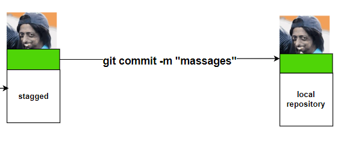

### **Life Cycle of File in GIT**
Every file in GIT is in one of the following states:

 **1)Untracked:**
---
✽ The files which are newly created in working directory and git does not aware of these 
files are said to be in untracked state.

 **2)Staged:**
---
✽ The files which are added to staging area are said to be in staged state.

✽ These files are ready for commit.

 **3)In Repository/ Committed:**
---
 ✽ Any file which is committed is said to be In Repository/Committed State.

**4)Modified:**

✽ Any file which is already tracked by git, but it is modified in working directory is said to 
be in Modified State.

 ### **To Understand Working Directory,Staging Area and local Repository**
 ---
 1) Creating workspace
2) git initialization
3) Creating files with some content in the working directory
4) Adding these files to staging area
5) Git Configurations before first commit
6) Commit those changes to local repository.
###  **From working directory to   staging area**
* Now project1 acts as working directory. We have to request git, to provide version control 
for this directory. For this we have to use git init command.

* git init -->> This command will provide empty repository for our working directory, so that 
version control is applicable for our workspace.
The name of the empty directory is .git, which is hidden directory.

Note: 
1) If our working directory contains any files, then these files won't be added to the local 
repository bydefault, we have to add explicitly.
2) If our working directory already contains local repository(.git), still if we call git init 
command, then there is no impact.
### **Creating Files with some Content and adding to staging Area and then commit:**
---

* 

###
~~~
git add a.txt b.txt
~~~

this means our file a.txt b.txt is added from working directory to staging area. color green.
.
### bring back from staging area to working directory

~~~
git restore --staged a.txt b.txt
~~~
.

---
###  **From staging area to local repository**
~~~
git commit -m "massages"
~~~

* after commit

### **From local repository to staging area**
~~~
Committed files to Staging Area

git reset --soft HEAD^1

~~~

### **RECAP**

### **command**
1. git init
2. git status
3. git add <filename>
4. git commit -m "massages"
5. git log 
6. git log --oneline 
~~~ 
7.  git restore --staged <filename>
~~~
8. git reset --soft HEAD~1

