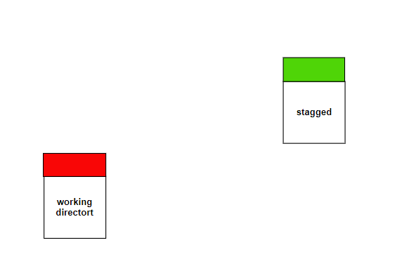
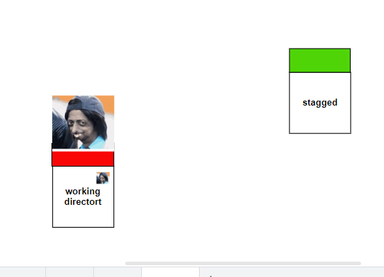
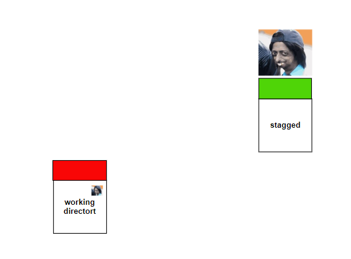

###  Removing Files by using git rm Command

----------------

* It is very common requirement to remove files from working directory and staging area. 
For these removals we can use the following commands.
> git rm file1.txt

>  git rm --cached file1.txt

 > General Linux rm command
### **Case-1: To Remove Files from Working Directory and staging Area (git rm)**
--------------------
* If we want to remove a file from working directory and from staging area then we should 
go for git rm command.
###  **before using git rm**
------------------

~~~
git rm <salman khan>
~~~
###  **After using git rm salmankhan**

* file1.txt will be removed from staging area and from working directory.
* Note: for git rm command argument is mandatory.
 
~~~
 git rm
 
fatal: No pathspec was given. Which files should I remove?
~~~
~~~
$ git rm .
fatal: not removing '.' recursively without -r
It won't work because we didn't use -r option.
$ git rm -r .
 It will remove all files
~~~
### Case-2: To Remove Files Only from staging Area (git rm --cached)
* If we want to remove the file only from staging area but not from working directory then 
we should use git rm --cached command.
* git rm --cached file4.txt
>   file4.txt will be removed only from staging area but not from working directory .
.

### Case-3: To Remove Files Only from Working Directory (rm Command)
-----------------------
We can use general linux command rm to remove files from working directory.

* Note:
1) git rm file1.txt --->> It will remove file from both working directory and staging area
2) git rm --cached file1.txt --->>> It will remove file only from staging area but not from 
working directory
3) rm file1.txt --->> It will remove file only from working directory but not from staging area.

----------------------
### **Undo Changes with git Checkout Command**
----------------------
* We can use checkout command to discard unstanged changes in the tracked files of 
working directory.
* Observe the 3 words:
---------------------
1) Only for working directory.
2) To discard unstaged changes(The changes which are not added to staging area).
3) In the tracked files (The files which are already added to staging area/commit).

    It is something like undo operation.

    It will copy contents of the file from index 
area(staging area) to working directory.

~~~
git checkout -- filename
~~~
Eg:
$ git checkout -- file1.txt
It will discard any unstaged changes made in file1.txt.
After executing this command, staged copy content and working directory content is 
same.

Summary:

git checkout -- file.txt

 To discard changes in working directory copy.

git checkout
 To discard changes in all tracked files of working directory.

git checkout
 If we are not passing any argument, then this command will show the list of eligible files 
for checkout.

Note:
---------------
git checkout command can be used in branching also

